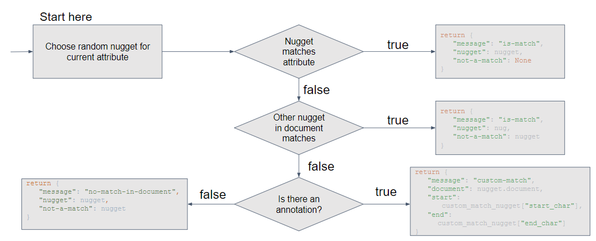

## WannaDB - Custom Extractor Evaluation

This folder contains all necessary code and structures relating to the evaluation of the custom extractors in WannaDB. The evaluation code is based on the evaluation code used for ASET, as can be found [here](https://github.com/DataManagementLab/ASET-dev/tree/btw23reproducibility).

### Strategy

The strategy is based on the evaluation setup of ASET. To examine the potential benefit of the custom extractors, user feedback needs to be simulated. For this, the automatic feedback component `AutomaticRandomCustomMatchingFeedback` is created in `automatic_feedback.py` that works similar to that of ASET, with the main distinction being that if no proper nugget for an attribute is extracted in a document, the annotation is used as a custom match feedback, given that an annotation exists. View the flow chart below for a full visualisation of the feedback process.

 

This process can be repeated for each extractor, where the simulated user gives a varying number of feedbacks $n \in [10, 20, 30]$, for each of which 20 total runs are repeated and the results are averaged across all random runs.

### Running the evaluation

In order to run the evaluation, one needs to follow these steps:

1. Place the aviation and / or nobel annotation .json files into `evaluation/datasets/aviation/documents` and `evaluation/datasets/nobel/documents`, respectively.
2. If you have the document base already preprocessed, place them into `cache`. Otherwise, the experiment itself will run the preprocessing, for which you will need to place the raw documents into `evaluation\datasets\dataset_name\raw-documents`.
3. Set the `USED_EXTRACTOR` variable in `experiment_3.py` to the extractor you want to evaluate, and the `dataset_str` to the dataset you want to evaluate on. Note that if you want to use the `FAISS` extractor, you need to pass the document base to the extractor as parameter once upon creation.
4. Run the experiment script `experiment_3.py`

The results will be stored under `evaluation/results/dataset_name/`, where a folder will be created for every evaluated extractor, and for each number of interactions. The created result files correspond to those of ASET.

### Evaluating the results

To create the plots of F1 scores per attribute and extractor and corresponding inference times, run the script `plot_results.py`. Prior to execution, you'll need to set `DATASET` to the dataset you want to evaluate the extractors on, and insert all extractors you want to include into the `ORDER` list and adjust the `PRETTY_LABELS` accordingly. If you already have computed results available, `experiment_3.py` does not need to be run again, simply place the results into the `evaluation/results` folder similar to as described above. 
