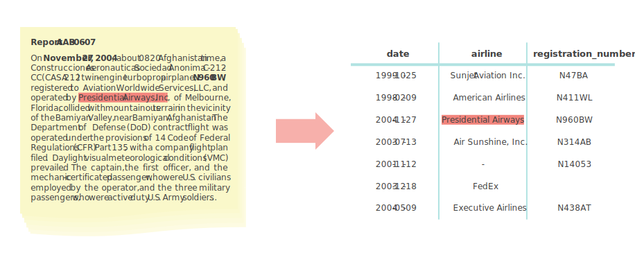

# WannaDB: Ad-hoc SQL Queries over Text Collections

WannaDB allows users to explore unstructured text collections by automatically organizing the relevant information nuggets in a table. It supports ad-hoc SQL queries over text collections using a novel two-phased approach: First, a superset of information nuggets is extracted from the texts using existing extractors such as named entity recognizers. The extractions are then interactively matched to a structured table definition as requested by the user.

Watch our [demo video](https://link.tuda.systems/aset-video) or [read our paper](https://doi.org/10.18420/BTW2023-08) to learn more about the usage and underlying concepts.

# Underlying architecture and ideas

This section gives a brief insight into the ideas facilitating the possibilities provided by WannaDB.

## Cosine distance

The cosine distance is used to measure the similarity between text snippets (nuggets) or text snippets and attributes. It's calculated as the cosine distance between the embedding vectors of two nuggets or a nugget and an attribute.   
In order to decide whether a nugget matches an attribute, the system calculates the cosine distance between the nugget and either the attribute to match or the closest nugget identified as a confirmed match for this attribute. The initial distance of a nugget is always its distance to the corresponding attribute. During the feedback process, the feedback process keeps track of the confirmed matches for this attribute and might update the nuggets distance to the distance to a confirmed match if this lowers the nuggets distance. The shorter the computed distance, the greater the confidence that this nugget matches this attribute.
This distance is calculated for each extracted nugget within a document and the nugget with the lowest distance is considered as the best match of this document.  
As the user gives feedback the cosine distance of a nugget might change as this feedback might result in a close confirmed match. 

## Threshold

The threshold refers to the maximum cosine distance from which a nugget isn't be considered as a match for an attribute and therefore not added to the resulting table. The best match of a document is only added to the table if its distance is below the current threshold.
During the user's feedback process, the threshold might change its value multiple times to utilize the user's feedback as much as possible. 

## Interactive matching process

The interactive matching process is the workflow in which the cells of the table are populated based on feedback given by the user.  
In order to populate cells related to some attribute, the user gives feedback to the corresponding nugget matches determined by the system. The feedback provided by the user (confirms/rejects a match) for a specific document influences the computed distance of other nuggets and the threshold as there might be new confirmed matches. Therefore, each feedback round might lead to changing best matches in other documents.  
In this way, the system kind of learns from the user's feedback and tries to improve the resulting table with each feedback round without requiring user feedback for each document.
